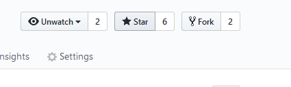

## V 0.10-alpha
A brand new menu has been added, with 3d animations and stuff, we hope you like it (see project for more to-do-list info). 
Our current goal is to create realistic impact particles, using the integrated panda3d particle generator, which will contribute to the realism of the game and allow us to consider working on a well thought HUD for the players.
It is possible to import 3d models and test simulations using those, but it is very hard to master though, as I haven't created a syntax guide for users. If you still wish to do so, please contact us by creating a [new issue](https://github.com/the-fancy-corporation/The-PyOS-Project/issues/new/choose)

### Some screenshots

## Installing test versions
It is not recommended to use versions other than the ones merged into the **master** branch. Most of the other branches contain outdated or unstable versions, than may not be safe for common usage. However, if you wish to test our last commits, or simply read the code, please feel free to press the [Clone or download] button. Executing the code requires a basic python IDE, and the **panda3d** library.
Install it using in the windows cmd or whatever shell you use:
`pip install panda3d==1.10.3`
## Installation
Just [download](https://github.com/the-fancy-corporation/The-PyOS-Project/releases/download/v0.10-alpha/PyOS-0.10-alpha.zip) the latest release, extract the files, and run the **PyOS.exe** file *(if you're using windows, if you have linux or mac, just go to the correct folder)*.
There are no other requirements for this program to work

## Contribution to the building of the project
If you find what seems to be a bug, and is not listed in the [To-do-list](https://github.com/the-fancy-corporation/The-PyOS-Project/projects/1), please be kind and report it in the issues section, we will definitely appreciate your help.

## Adding planets (temporary)
coming soon in the next update
## Please support our work ;)
Don't forget to star our project if you like it and/or want to be notified about updates:

